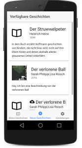

#  TaleTime 
TaleTime is an interactive audiobook app for iOS and Android.

<br>

**TaleTime** is an innovative app for Android and iOS, that lets children experience a new unique way of listening to audiobooks.

Besides our professionally recorded audiobooks we also give parents the opportunity to record the stories themselves. Recording is very convenient and of course can be done without extensive technical know-how. TaleTime also offers children the opportunity to influence the course of the stories themselves.

<br>

<p align="center">
    
</p>


## Getting Started
### Building TaleTime
 1. Clone this repository<br>
 	``git clone https://github.com/TaleTime/TaleTime.git``
2. Install Ionic and Cordova<br>
	``npm install -g cordova ionic``
3. Install dependencies<br>
	``npm install``
4. Install Cordova plug-ins

	```
	npm install @ngx-translate/core --save
	npm install @ngx-translate/http-loader --save
	ionic cordova plugin add cordova-plugin-globalization
	npm install --save @ionic-native/globalization
	ionic cordova plugin add cordova-plugin-file
	npm install --save @ionic-native/file
	ionic cordova plugin add cordova-plugin-tts
	npm install --save @ionic-native/text-to-speech
	ionic cordova plugin add cordova-plugin-speechrecognition
	npm install --save @ionic-native/speech-recognition
	ionic cordova plugin add cordova-plugin-nativeaudio
	npm install --save @ionic-native/native-audio
	ionic cordova plugin add cordova-sqlite-storage
	npm install --save @ionic/storage
	```


### Run the application
- In a browser without Cordova plugins<br>
	``ionic serve``
- In a browser with Cordova plugins<br>
	``ionic cordova run browser``
- On Android<br>
	``ionic cordova run android``
- On iOS<br>
	``ionic cordova run ios``

Use `--livereload` or `-l` to enable livereload.
Use `-c` to enable terminal logging.


## Contributing

When implementing a new feature or fixing a bug, please make sure that your code follows the same style as the existing codebase and try writing your code as understandable as possible. You should also test your changes and only commit them if they don't break anything. All comments should be in English.

You need to create a new branch for your feature or bug fix with ``git checkout -b <branch-name>``. Now you can make your changes and commit them. Please always use the commit messages to describe briefly what you did. Then push your changes to GitHub with ``git push -u origin <branch-name>`` and open a pull request.


## Architecture

The app is built with the Ionic and Angular.js (version 1) frameworks.

- [Interaction Design](docs/interaction_design.md)  
  Explains how the user will interact with the app.
- [App Architecture](docs/app_architecture.md)  
  Fundamental structure of the app (abstract).
- [User Accounts](docs/UserAccounts.md)  
  Content of the user profile and its properties.
- [Story Structure](docs/story_structure.md)  
  How stories are built and can be generated.


## Roadmap

Of course this project is not finished. There are several features that we still want to realize.
For this we designed a special [roadmap](https://www.github.com/TaleTime/TaleTime/projects/1).
You can head over there and have a look at all the open issues and start developing on a feature
of your interest right away.


## About us

This project was developed by several students of [Hochschule für Technik und Wirtschaft Saar](http://www.htwsaar.de 'HTW Saar Homepage').
It has been in continous development for two years and now finally we want to take advantage of the huge
open source community of github.


## License

The main app is licensed under GPLv3, other parts may be licensed differently. For further information, please refer to our [license](LICENSE).
